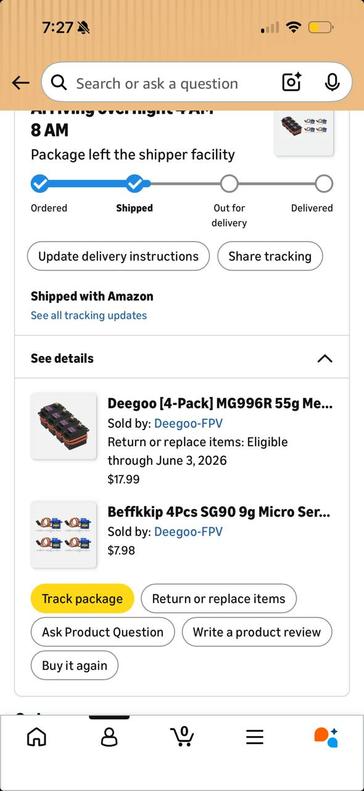
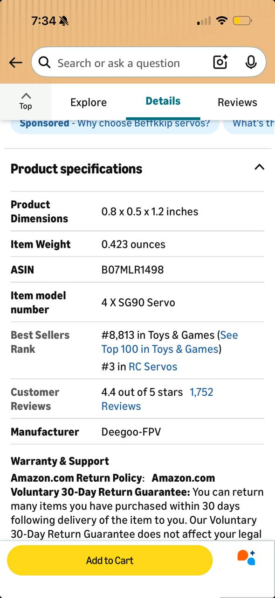
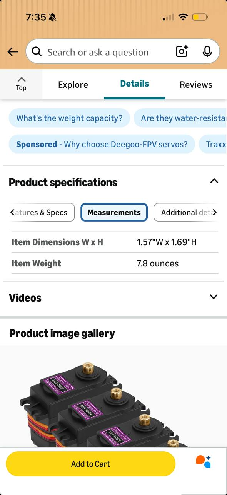
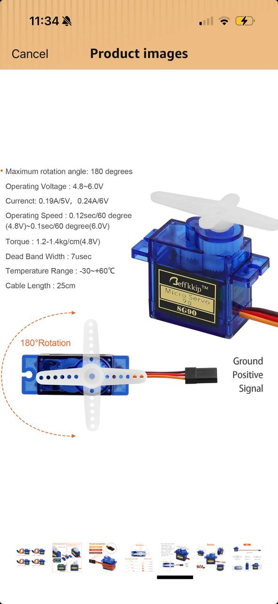
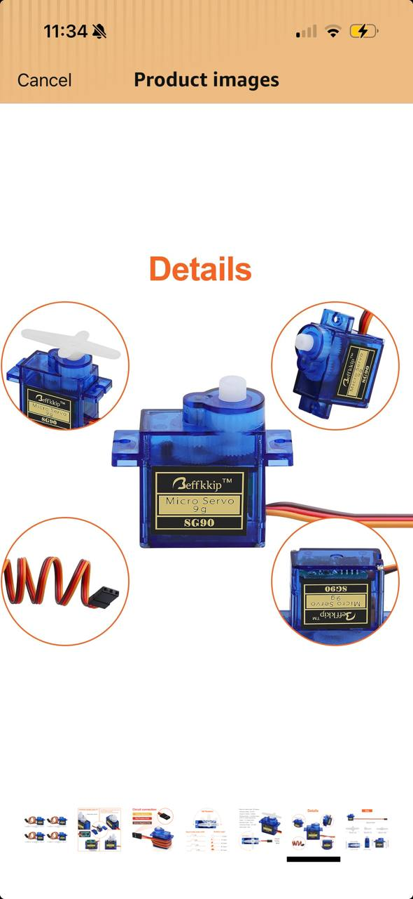
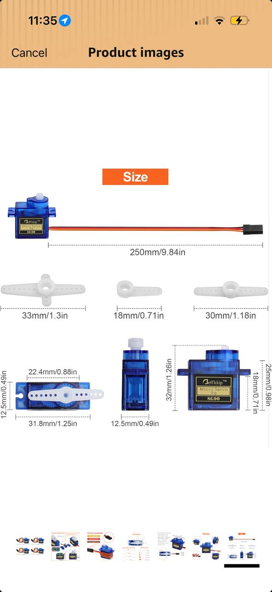

# Robot Arm Notes — Servo Elbow v0

Goal: take baby steps toward a robot arm.

Step 1 prototype: **two printed blocks/links joined by one servo as an elbow joint**.

## Ordered servos



Ordered:

- **SG90 9g micro servos** — best for first quick prototype.
- **MG996R 55g-ish metal gear servos** — larger/stronger, better after the hinge pattern works.

## SG90 specs / notes



Screenshot specs:

- Product dimensions: **0.8 × 0.5 × 1.2 in**
- Approx mm: **20.3 × 12.7 × 30.5 mm**
- Item weight shown: **0.423 oz** (~12 g)

CAD assumptions used in `sg90_elbow_v0.scad`:

- Servo pocket: **23 × 13.5 × 31 mm**
- Fixed block: **60 × 30 × 24 mm**
- Moving link: **70 × 20 × 8 mm**
- Horn pad: **28 mm diameter**

Notes:

- Use SG90 first: smaller, safer, faster print.
- Actual servo dimensions and horn hole spacing should be measured once delivered.
- Servo body mounts in fixed block; horn screws to moving link.

## MG996R specs / notes



Screenshot specs:

- Width × height: **1.57 in × 1.69 in**
- Approx mm: **39.9 × 42.9 mm**
- Item weight shown: **7.8 oz** — likely package/4-pack weight; typical single MG996R is closer to ~55 g.

CAD assumptions used in `mg996r_elbow_v0.scad`:

- Servo pocket: **41.5 × 21.5 × 43.5 mm**
- Fixed block: **82 × 48 × 52 mm**
- Moving link: **110 × 32 × 12 mm**
- Horn pad: **44 mm diameter**

Notes:

- MG996R has enough torque to twist/crack weak prints.
- Use thicker walls, larger screws, and base mounting holes.
- Better as v2 after SG90 elbow pattern works.

## Mechanical layout

The servo does not just float between the two blocks. Instead:

1. Servo body is rigidly captured/mounted in the **fixed block**.
2. Servo shaft sticks out sideways at the elbow.
3. Plastic servo horn mounts to the shaft.
4. Moving link screws onto the servo horn.

Rough diagram:

```text
fixed servo-holder block
┌────────────────────────┐
│      servo body        │
│                 shaft ●── horn + moving link
└────────────────────────┘
```

## Required holes/features

Fixed block:

- Servo body pocket
- Servo mounting screw holes
- Shaft clearance hole
- Wire/cable exit channel
- Optional base mounting holes

Moving link:

- Center access hole for servo horn screw
- 2–4 pilot holes for horn-to-link screws
- Optional lightening holes

## Files

- `sg90_elbow_v0.scad`
- `mg996r_elbow_v0.scad`

Each file has:

```scad
PART = "assembly"; // "fixed", "moving", "assembly"
```

Set `PART` before export:

- `fixed` — servo holder block
- `moving` — horn/moving link
- `assembly` — preview only

## Recommendation

Print the SG90 fixed + moving parts first. Fit the servo. Mark/measure anything off. Then tune parameters before printing MG996R.

## SG90 product rotation / electrical notes



Additional SG90 product-image specs:

- Maximum rotation angle: **180°**
- Operating voltage: **4.8–6.0 V**
- Current: **0.19 A @ 5 V**, **0.24 A @ 6 V**
- Operating speed:
  - **0.12 sec / 60° @ 4.8 V**
  - **0.10 sec / 60° @ 6.0 V**
- Torque: **1.2–1.4 kg·cm @ 4.8 V**
- Dead band width: **7 µsec**
- Temperature range: **-30°C to +60°C**
- Cable length: **25 cm**

Wiring shown:

- Brown / dark wire: **Ground**
- Red wire: **Positive / V+**
- Orange / yellow wire: **Signal**

Mechanical implication for this elbow design:

- Plan for approximately **180° of travel**, but keep software limits conservative at first, e.g. 20°–160°, to avoid crashing the printed link into the servo holder.
- The first SG90 elbow should carry only a light printed link/no load. Torque is small; long/heavy links will stall or jitter.
- Include enough clearance around the horn/link so the link can sweep without hitting the fixed block.

## SG90 detail/product views



This image is useful for visual orientation:

- Output shaft is on the top face, offset toward one end of the servo body.
- Mounting tabs/flanges extend from the sides and each has a screw hole.
- Cable exits from one side/rear of the body.
- Included white plastic horn attaches to the output spline and is the safest interface for the printed moving link.

Design implication:

- The fixed block should leave clearance for the side tabs and cable exit.
- The shaft-side wall needs a clearance hole/slot so the horn can sit outside the fixed block.
- The moving printed link should screw into the white horn rather than directly gripping the spline.

## SG90 size/dimension reference



Useful dimensions from product image:

- Cable length: **250 mm / 9.84 in**
- Servo body front width: **31.8 mm / 1.25 in** including mounting tabs/flanges
- Main body width: **22.4 mm / 0.88 in**
- Body depth/thickness: **12.5 mm / 0.49 in**
- Body height: **32 mm / 1.26 in**
- Front face/body height shown: **25 mm / 0.98 in** plus output shaft/boss
- Side/tab height shown: **12.5 mm / 0.49 in**
- Alternate horn lengths shown:
  - double-arm horn: **33 mm / 1.3 in**
  - short horn: **18 mm / 0.71 in**
  - double-arm horn: **30 mm / 1.18 in**

Design updates / implications:

- Servo pocket for SG90 should be at least **23 × 13.5 × 32.5 mm** to clear the body.
- Mounting-tab clearance should account for about **32 mm total width** across tabs.
- The moving-link horn pad should support 30–33 mm horns, so a **28–32 mm pad** is reasonable for v0.
- Cable channel should support a 250 mm cable exiting without sharp bends.

## Next steps / future dig-in: Text-to-CAD / robot mechanism tool

Saved from Jake Fitzgerald / @earthtojake post on X, dated **2026-05-20**.

Screenshot: `images/text-to-cad-jake-fitzgerald-2026-05-20.jpg`

Post summary:

> New release for text-to-CAD, an open source CAD harness and skills for Codex / Claude:
>
> - mechanism validation — go from text prompt to functional mechanical design
> - parameters + animations for STEP files
> - extended SDF, SRDF, URDF support
>
> 3k stars, 10k downloads

Why it matters for this project:

- Could be useful for the robot arm / 3D-printing workflow.
- Specifically relevant to generating and validating mechanical mechanisms from prompts.
- SDF/SRDF/URDF support may help later if this robot arm becomes a ROS/simulation project.
- STEP parameter + animation support sounds useful for checking servo/link motion before printing.

Follow-up:

- Find the actual GitHub repo/project from the post.
- Evaluate whether it can produce OpenSCAD/STEP/URDF assets useful for the SG90/MG996R robot-arm experiments.
- Try a small prompt like: “two-link servo elbow with SG90 mount, sweep 10–90 degrees, avoid self-collision.”

## Text-to-CAD cradle experiment notes

Goal: try CAD Skills / build123d as a STEP-first workflow for an SG90 servo cradle.

Why try this:

- `build123d` uses Python, which should make variants easier than OpenSCAD.
- STEP is better than STL for editing, measuring, and reusing CAD.
- STL can still be exported later for slicing and printing.
- URDF/SRDF may become useful later if the robot arm moves toward ROS or MoveIt.

First cradle workflow:

1. Create a `build123d` Python source file for an SG90 cradle.
2. Generate a STEP file from that source.
3. Inspect the STEP dimensions and geometry.
4. Open the STEP in CAD Explorer for visual review.
5. Export an STL for Cura only after the STEP looks right.
6. Print a small fit test.
7. Tune servo pocket, screw holes, wire channel, and shaft/horn clearance.
8. If SG90 works, add parameters for MG996R.

First prompt idea:

> Create a parametric build123d STEP model in millimeters for an SG90 servo elbow test bracket.
>
> Make a fixed base with four M3 mounting holes, a raised SG90 servo cradle, an open top pocket for a 22.4 x 12.5 x 32 mm SG90 body, clearance for 31.8 mm mounting ears, a side cable exit, and a shaft-side opening so the servo horn can rotate outside the block.
>
> Use conservative FDM clearances: 1.2 mm body clearance, 2.0 mm depth clearance, 3 mm walls, and 4 mm base thickness. Put named parameters at the top. Export STEP first and STL second.

Open questions:

- Do we install CAD Skills locally, or just copy the needed workflow into this repo?
- Do we keep OpenSCAD as the main source, or start using `build123d` for robot-arm parts?
- What is the first physical fit target: bare SG90 body, SG90 with horn, or full elbow assembly?

Text-to-CAD repo mental model:

- It is not a normal CAD app; it is a set of agent workflows plus helper scripts.
- Basic flow: user describes a part, agent writes source code, scripts generate STEP/STL/GLB, inspection/viewer tools check the output, then the agent edits source and regenerates.
- `SKILL.md` files are entry points; `references/` files are loaded only when needed.
- CAD Explorer does not generate CAD. It views existing STEP/STL/GLB/URDF/SRDF/SDF outputs in a browser.
- There are two toolchains: Python CAD generation for STEP/STL, and a Node viewer toolchain for CAD Explorer.

CAD ecosystem map:

- Code-CAD means writing code/scripts to generate shapes. Examples: OpenSCAD, CadQuery, build123d.
- GUI-CAD means drawing/manipulating geometry in an interactive app. Examples: FreeCAD, SolidWorks, Fusion, Inventor, CATIA, Creo, NX.
- The deeper relationship depends on the geometry kernel: the math engine that represents solids, surfaces, curves, intersections, booleans, fillets, and exports.

OpenCascade / OCCT ecosystem:

- FreeCAD: GUI CAD app plus a large Python framework, built on OpenCascade.
- CadQuery: Python parametric CAD library built on OpenCascade.
- build123d: newer Python parametric CAD library built on OpenCascade; overlaps with CadQuery but uses a different API style.
- These tools are separate projects, but they share the same underlying geometry family. This makes STEP-style solid CAD workflows more natural.

Other CAD ecosystems:

- OpenSCAD is a separate code-CAD ecosystem based on constructive solid geometry: `union`, `difference`, and `intersection`. It is excellent for simple scriptable 3D-printing models, but it is not part of the OpenCascade family and usually outputs mesh-oriented STL.
- SolidWorks, Siemens NX, and Solid Edge use Parasolid.
- CATIA uses Dassault's CATIA Geometric Modeler / CGM ecosystem.
- Creo / Pro/ENGINEER uses PTC Granite.
- AutoCAD, Inventor, and Fusion use Autodesk ShapeManager, derived from ACIS.
- STEP is the practical bridge between many of these worlds.

CSG vs B-Rep:

- CSG engines, such as OpenSCAD, combine and subtract primitive shapes. In normal 3D-printing workflows, curved shapes eventually become triangle meshes.
- B-Rep engines, such as OpenCascade and Parasolid, track exact surfaces, edges, and curves mathematically, often using analytic surfaces and NURBS.
- Practical impact: CSG/OpenSCAD is simple, scriptable, and great for many printable parts. B-Rep/OpenCascade-style CAD is better for precise mechanical geometry, STEP export, fillets, chamfers, face/edge references, and downstream CAD edits.

## Next steps / future dig-in: Open Duck Mini

Link: https://github.com/apirrone/Open_Duck_Mini

Tag: **next steps, for the future, dig into this**

Why it may matter:

- Open-source small biped/robot project; likely useful as a reference for mechanical design, actuation layout, printed parts, electronics, and control stack.
- Could provide examples for how to structure a more complete robot project beyond the current SG90/MG996R baby-step arm.
- Potentially relevant if the robot-arm work expands into ROS/simulation/control, since complete robot repos often include CAD, BOM, firmware, gait/control notes, and assembly patterns.

Follow-up:

- Clone/read the repo when ready.
- Look specifically for CAD files, servo/actuator choices, assembly docs, BOM, firmware, and simulation/URDF assets.
- Extract design patterns applicable to the robot arm: modular printed joints, cable routing, servo mounting, calibration, safe motion limits, and testing workflow.

## Next steps / future dig-in: Zach Dive X post

Link: https://x.com/zachdive/status/2057266094809948498?s=46&t=oFidhmClqAQlH3MbSBeFTQ

Tag: **next steps, for the future, dig into this**

Why it may matter:

- Adi flagged this alongside the text-to-CAD and Open Duck Mini references for the robot arm / 3D-printing / CAD exploration track.
- Need to open/read the post later and extract the concrete tool, repo, workflow, or design idea.

Follow-up:

- Resolve the X post content when browser/Twitter access is available.
- Save any referenced repo/media/screenshots locally if relevant.
- Compare against the existing text-to-CAD and Open Duck Mini notes for applicability to robot arm design, simulation, CAD generation, servo motion planning, or ROS/URDF workflows.

## Next steps / future dig-in: MIT GenCAD image-to-CAD

Source screenshot: `images/gencad-image-to-cad-2026-05-20.jpg`

Tag: **next steps, for the future, dig into this**

Post summary from screenshot:

- “A photo goes in. A CAD file comes out.”
- MIT released **GenCAD**, described as a model that converts an image of a mechanical part into an editable parametric CAD program.
- Framed as image-to-CAD, not text-to-image/render generation.
- Screenshot shows “GenCAD: CAD retrieval (image conditional)” with retrieved CAD from ~7,500 unseen CAD programs.

Why it may matter:

- Could help convert photos/screenshots of mechanical parts into editable CAD starting points.
- Potentially useful for reverse-engineering servo brackets, linkages, gears, mounts, or inspiration parts for the robot arm.
- Complements the text-to-CAD note: this is image/photo-to-CAD rather than prompt-to-CAD.

Follow-up:

- Find the actual MIT GenCAD paper/repo/demo.
- Check whether it outputs usable parametric CAD, STEP, OpenSCAD, CadQuery, or another editable format.
- Test with a simple robot-arm part photo or servo bracket image if a runnable demo exists.

## Next steps / future dig-in: ForgeCAD + GPT-5.5 / image-to-product-CAD workflow

Source screenshot: `images/forgecad-gpt55-product-to-cad-2026-05-20.jpg`

Tag: **next steps, for the future, dig into this**

Post summary from screenshot:

- Ruben Kostandyan post: “Generate an image of a product with ChatGPT Images 2.0 and convert to CAD with GPT-5.5 in Codex with ForgeCAD.”
- Screenshot shows a product/watch image on one side and an editable CAD/modeling environment on the other.

Why it may matter:

- Relevant to the image/concept-to-CAD workflow for robot parts and 3D-printable mechanisms.
- Could be useful for starting from a visual product concept, then generating editable CAD suitable for refinement/printing.
- Complements the GenCAD and text-to-CAD notes: concept image → CAD, not just photo → retrieval or text → mechanism.

Follow-up:

- Find ForgeCAD docs/repo/demo and understand supported output formats.
- Test whether Codex can use ForgeCAD to create or modify practical robot-arm parts.
- Compare generated CAD quality against current OpenSCAD/CadQuery-style workflow.

## Next steps / future dig-in: Claude CAD + build123d parametric rack example

Source screenshot: `images/claude-cad-build123d-full-rack-2026-05-21.jpg`

Tag: **next steps, for the future, dig into this**

Post summary from screenshot:

- Brian Ratliff / @BrierRat post, dated 2026-05-13.
- Text: “Boom. Claude CAD. Full rack.”
- Notes that Claude CAD can save time over manual CAD for designs with many configurations.
- Example: multiple drawer configurations; standard CAD can do it, but it is not base-skill obvious.
- With **build123d Python scripting**, the configuration becomes easy with a config flag.

Why it may matter:

- Strong reference for using Python-based parametric CAD instead of purely manual CAD.
- Relevant to robot arm parts where variants matter: servo sizes, bracket widths, link lengths, screw holes, horn styles, cable channels, and safe travel envelopes.
- Suggests a workflow where one script can generate many printable variants by changing config values.

Follow-up:

- Look into Claude CAD and build123d examples.
- Consider porting some robot-arm OpenSCAD parts to build123d/CadQuery-style Python if it makes variants easier.
- Try a config-driven servo bracket generator: SG90 vs MG996R, pin clearance, horn clearance, link length, and screw-hole positions.

## Next steps / future dig-in: Ruben Kostandyan CAD/X post

Link: https://x.com/ruben_kostard/status/2057926663694934273?s=46&t=oFidhmClqAQlH3MbSBeFTQ

Tag: **next steps, for the future, dig into this**

Why it may matter:

- Adi flagged this as another CAD / 3D-printing / robotics reference to investigate later.
- Likely related to the prior Ruben Kostandyan / ForgeCAD thread about image/product-to-CAD workflows.

Follow-up:

- Resolve/read the X post content later.
- Save screenshots/media/repo links if relevant.
- Compare it with the existing ForgeCAD, GenCAD, Claude CAD, and build123d notes for applicability to robot-arm parts and printable CAD workflows.

## Next steps / future dig-in: ROS middleware + coding-model robotics workflow

Link: https://x.com/chris_j_paxton/status/2057913280862019907?s=46&t=oFidhmClqAQlH3MbSBeFTQ

Source screenshot: `images/ros-middleware-codex-robotclaw-2026-05-24.jpg`

Tag: **next steps, for the future, dig into this**

Post summary from screenshot:

- Chris Paxton notes that robotics software is painful because of the “boring middleware code” needed between sensors, processes, and tools.
- The quoted post describes using Codex to set up ROS middleware, configure a CSI camera, benchmark Gemma 4 models on a Jetson Orin Nano, adapt an OpenClaw runtime for VLM reasoning (“Robotclaw”), and build an iOS app streaming LiDAR, camera, GPS, and IMU data.

Why it may matter:

- Directly relevant if the robot arm grows from simple Arduino servo control into a ROS/sensor/perception project.
- Suggests a practical path for using coding agents to generate the glue code around cameras, sensors, VLMs, Jetson hardware, and ROS nodes.
- Useful mental model: robotics progress may come from automating middleware scaffolding, not just better models or better CAD.

Follow-up:

- Read the original thread and quoted post in full.
- Identify any repos, scripts, or architecture diagrams for the ROS/Codex/Robotclaw setup.
- Compare with current local YOLO + Arduino servo work: what would it take to turn that into a ROS node graph?
- Investigate whether a future robot-arm stack should use ROS 2, simple Python processes, or a hybrid approach.

## Next steps / future dig-in: CadX Studio parametric CAD engine

Link: https://x.com/cadx_studio/status/2058637963677007894?s=46&t=oFidhmClqAQlH3MbSBeFTQ

Site from screenshot: https://engine.cadxstudio.in

Source screenshot: `images/cadx-studio-parametric-brake-rotor-2026-05-24.jpg`

Tag: **next steps, for the future, dig into this**

Post summary from screenshot:

- CadX Studio announced that “cadx is live.”
- Demo: a brake rotor with **42 parameters**, cross-drilled holes, vanes, and auto-generated manufacturing notes.
- Screenshot shows a browser-based parametric CAD UI with sliders/controls and a 3D brake rotor preview.

Why it may matter:

- Relevant to parametric CAD workflows for robot-arm parts and 3D-printable mechanisms.
- The parameter-heavy brake rotor example is a good reference for making configurable mechanical parts instead of one-off static models.
- Auto-generated manufacturing notes could be useful for documenting print settings, tolerances, assembly notes, or fabrication constraints.

Follow-up:

- Try CadX Studio / engine.cadxstudio.in and see whether it exports STEP/STL/CAD source.
- Compare its workflow with build123d, ForgeCAD, GenCAD, and the current OpenSCAD robot-arm files.
- Test whether it can create configurable servo brackets, horn adapters, linkage plates, or joint housings.

## Next steps / future dig-in: CadX Studio follow-up post

Link: https://x.com/cadx_studio/status/2059238566224687506?s=46&t=oFidhmClqAQlH3MbSBeFTQ

Tag: **next steps, for the future, dig into this**

Why it may matter:

- Adi flagged this as another CadX Studio / CAD / 3D-printing / robotics reference to investigate later.
- Likely related to the prior CadX Studio parametric CAD engine note and may include an updated demo, feature, workflow, or product direction.

Follow-up:

- Resolve/read the X post content later.
- Save screenshots/media/repo/docs links if relevant.
- Compare with the existing CadX Studio, ForgeCAD, GenCAD, Claude CAD, and build123d notes for robot-arm part generation workflows.
- Check whether it helps with configurable servo brackets, horn adapters, linkages, joint housings, manufacturing notes, or export formats.

## Next steps / future dig-in: Train robot from human action

Link: https://x.com/iliraliu_/status/2059544160810541152?s=46&t=oFidhmClqAQlH3MbSBeFTQ

Tag: **next steps, for the future, dig into this**

Note from Adi: **train robot to do something using human action**

Why it may matter:

- Relevant to imitation learning / learning-from-demonstration for robotics.
- Could become useful if the robot-arm project moves beyond scripted servo sweeps into teaching motions from human examples.
- Worth investigating for workflows where a human demonstrates an action, then the robot learns or replays the task.

Follow-up:

- Resolve/read the X post content later.
- Identify whether it points to a repo, paper, demo, dataset, teleoperation workflow, or robot policy training method.
- Compare with current robot-arm stack: what sensors, recordings, servo control, and safety constraints would be needed to teach the arm by human demonstration?
