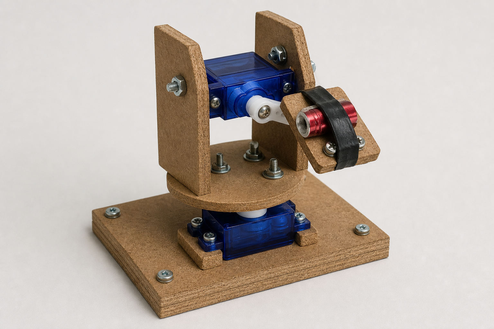

# Chipboard SG90 Vision Turret

This is a first mechanical mockup for a camera-guided tabletop turret:

- two `SG90` micro servos
- laminated chipboard plates
- screws, nuts, bolts, and washers for reinforcement
- a small toy laser pointer as the aiming payload
- Mac mini or laptop vision loop sending commands to Arduino motor control

The intended control loop is:

1. Camera frame is processed on the computer.
2. CV detects an object and estimates its image center.
3. The computer sends pan/tilt corrections to the Arduino.
4. Arduino moves the `SG90` servos.
5. The loop repeats until the pointer is aligned with the target.

## Mockup

## Build Notes

- Start with a 2-servo pan/tilt layout before building a full arm.
- Laminate 2-3 chipboard layers for the base.
- Double the vertical side plates around the tilt servo.
- Keep the laser close to the tilt axis to reduce load on the servo.
- Use washers anywhere screws or bolts touch chipboard.
- Treat the laser as a low-power alignment aid only; avoid eyes and reflective surfaces.
